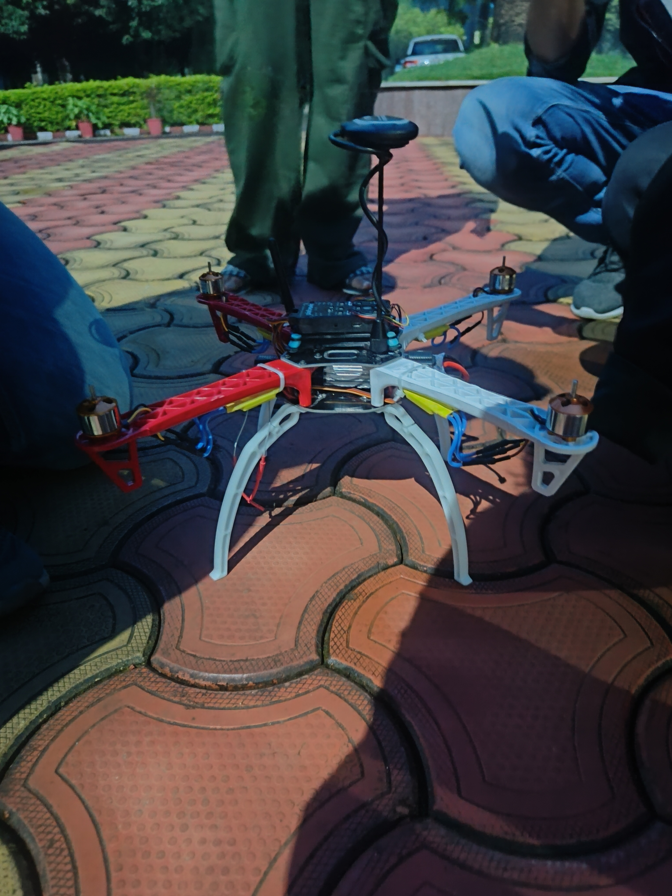

# Marutsakha
## Problem Statement
Litter in remote reserves like George Everest Peak needs efficient cleanup. Inaccessibility poses a challenge for regular cleaning, risking environmental harm. We propose using drones to accurately detect and locate garbage for targeted and efficient cleanups, preserving the pristine environment.
### Live Demo
https://youtu.be/jVCeZkKO8pw?si=y_RV4_JGUtL8gyAI
### ScreenShots

